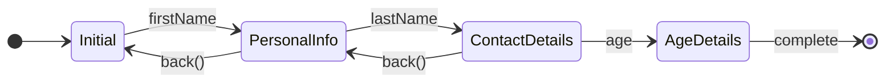

# JourneyBuilder

A Kotlin Android library that turns a simple annotated interface into a fully type-safe, back-stack-aware state machine — with zero boilerplate.

---

## The Problem

Multi-step data entry flows are everywhere in Android apps: onboarding, checkout, registration, surveys. The classic implementation — a `ViewPager` with fragments, or a hand-rolled state machine — forces you to:

- Maintain mutable shared state across screens
- Thread accumulated data through `Bundle`s or a shared `ViewModel`
- Write the same forward/back navigation logic on every flow
- Handle the "what data do I have at this step?" question with nullable fields and runtime checks
- Re-populate fields when the user navigates back — usually by passing data down through every screen

The result is a `RegistrationViewModel` with ten nullable fields, a `currentStep: Int`, and a `when` block that grows with every new requirement.

---

## What JourneyBuilder Does

You define only the data that each step introduces. JourneyBuilder's KSP processor generates:

- A **sealed state class** where each step carries exactly the fields collected so far
- **`nextFrom()` extension functions** on `JourneyStateMachine` that advance state type-safely
- A **`previousXxx` property** on each state pointing to the step the user came back from — so fields can be pre-populated on back navigation with no extra code
- A built-in **back stack** with `StateFlow`-based state you can collect in Compose or any observer

Each state in the machine is immutable and self-contained — no nulls, no shared mutable state.

---

## Flow Diagram



Each arrow forward carries only the **new** field collected at that step. Going back restores the previous screen with fields pre-populated from the state you came from.

---

## Setup

Add the KSP plugin and both dependencies to your module's `build.gradle.kts`:

```kotlin
plugins {
    id("com.google.devtools.ksp") version "2.0.0-1.0.21"
}

dependencies {
    implementation("io.github.saadfarooq:journey-builder:0.0.1")
    ksp("io.github.saadfarooq:journey-builder-ksp:0.0.1")
}
```

---

## Usage

### 1. Define your journey

Annotate an interface with `@Journey`. Each nested interface is a step, and each property is a field collected at that step. Steps inherit from previous steps to express accumulation:

```kotlin
import com.github.saadfarooq.journeybuilder.Journey

@Journey
interface RegistrationForm {
    interface PersonalInfo   { val firstName: String }
    interface ContactDetails : PersonalInfo { val lastName: String }
    interface AgeDetails     : ContactDetails { val age: String }
}
```

### 2. Use the generated state machine

KSP generates `RegistrationFormState` (a sealed class) and `nextFrom()` extensions automatically at compile time:

```kotlin
val machine = JourneyStateMachine<RegistrationFormState>(RegistrationFormState.Initial())
```

### 3. Drive your UI

Collect `machine.state` and call `nextFrom()` to advance. The compiler enforces which fields are required at each step. The generated `previousXxx` property on each state lets you pre-populate fields when the user navigates back:

```kotlin
@Composable
fun RegistrationFlow(machine: JourneyStateMachine<RegistrationFormState>) {
    val state by machine.state.collectAsState()
    val canGoBack = state is BackNavigable<*>

    BackHandler(enabled = canGoBack) { machine.back() }

    when (val s = state) {
        is RegistrationFormState.Initial ->
            FirstNameScreen(
                // pre-populated when user navigates back from PersonalInfo
                initialFirstName = s.previousPersonalInfo?.firstName ?: "",
                onNext = { machine.nextFrom(s, it) }
            )

        is RegistrationFormState.PersonalInfo ->
            LastNameScreen(
                firstName = s.firstName,             // type-safe — always present
                // pre-populated when user navigates back from ContactDetails
                initialLastName = s.previousContactDetails?.lastName ?: "",
                onNext = { machine.nextFrom(s, it) }
            )

        is RegistrationFormState.ContactDetails ->
            AgeScreen(
                // pre-populated when user navigates back from AgeDetails
                initialAge = s.previousAgeDetails?.age ?: "",
                onNext = { machine.nextFrom(s, it) }
            )

        is RegistrationFormState.AgeDetails ->
            SummaryScreen(
                firstName = s.prev.prev.firstName,
                lastName  = s.prev.lastName,
                age       = s.age,
                onStartOver = { machine.reset(RegistrationFormState.Initial()) }
            )
    }
}
```

The `previousXxx` property name is derived from the step name — `previousPersonalInfo` on `Initial`, `previousContactDetails` on `PersonalInfo`, and so on. It is `null` when arriving at a step for the first time, and populated when the user presses back.

### `JourneyStateMachine` API

| Method / Property | Description |
|---|---|
| `state: StateFlow<T>` | Current state, observable |
| `nextFrom(state, ...fields)` | Advance to the next step (generated per step) |
| `back()` | Go to the previous state, restoring `previousXxx` |
| `reset(initialState)` | Restart from a new initial state |

Back availability is derived from state in the UI: `val canGoBack = state is BackNavigable<*>`.

---

## License

```
Copyright 2026 Saad Farooq

Licensed under the Apache License, Version 2.0 (the "License");
you may not use this file except in compliance with the License.
You may obtain a copy of the License at

    https://www.apache.org/licenses/LICENSE-2.0

Unless required by applicable law or agreed to in writing, software
distributed under the License is distributed on an "AS IS" BASIS,
WITHOUT WARRANTIES OR CONDITIONS OF ANY KIND, either express or implied.
See the License for the specific language governing permissions and
limitations under the License.
```
